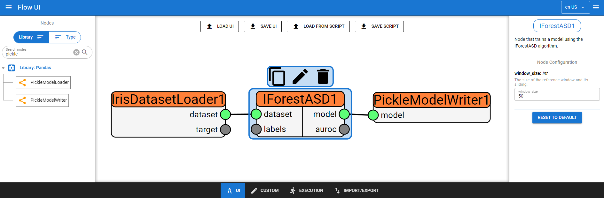
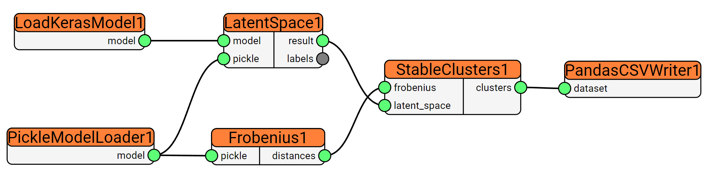

[](https://app.codecov.io/gh/SIMPLE-DVS/rainfall/tree/master/simple-backend)
[](https://app.codecov.io/gh/SIMPLE-DVS/rainfall/tree/master/simple-ui)

# RAINFALL-UI

RAINFALL-UI allows a data scientist, even a non-expert programmer, to graphically setup a DataFlow node by node, as well as configuring each of them. From the UI it is possible to create new custom nodes thanks to an integrated editor and also start the execution of a DataFlow, while looking at the progress and the logs produced.

## Installation

### Backend-Frontend

The [Backend README](simple-backend/README.rst) contains more instructions on how to launch/develop the backend.

The [Frontend README](simple-ui/README.md) contains more instructions on how to launch/develop the frontend.

### Docker

RAINFALL-UI is available as a Docker image by creating it from the [Dockerfile](Dockerfile) or pulling it from [DockerHub](https://hub.docker.com/r/dragonalex98/rainfall).

## Examples

## Trivial example

An example of a simple DataFlow is represented in the image below:



where:

- _IrisDataLoader1_: loads the famous iris dataset;
- _IForestASD1_: creates a model using the isolation forest algorithm;
- _PickleModelWriter1_: save the created model in the local file system.

Once saved, the corresponding DataFlow is a Python script that looks like this:

```python
import rain as sr

df = sr.DataFlow("dataflow1")

IrisDatasetLoader1 = sr.IrisDatasetLoader(
    node_id="IrisDatasetLoader1",
    separate_target=False,
)

IForestASD1 = sr.IForestASD(
    node_id="IForestASD1",
    window_size=50,
)

PickleModelWriter1 = sr.PickleModelWriter(
    node_id="PickleModelWriter1",
    path="./model.pkl",
)

df.add_edges([
    IrisDatasetLoader1 @ 'dataset' > IForestASD1 @ 'dataset',
    IForestASD1 @ 'model' > PickleModelWriter1 @ 'model',
])

df.execute()
```

This script can then be executed by installing the [RAIN](https://github.com/SIMPLE-DVS/rain) library and all the other required dependencies.

There is also the possibility to launch the computation directly from the execution page of RAINFALL, where the RAIN library and the requirements are automatically detected and installed in a virtual environment in a chosen folder.

## Non-trivial example

A more complex example is provided as follows, where desired outcome of the analysis should be a model that is capable to distinguish whether a certain signal comes from a blade attached to a metalworking machine that is new, semi-new or worn-out:



where:

- _LoadKerasModel1_: is a custom node that loads a previously generated Keras model;
- _PickleModelLoader1_: loads a previously generated Pickle file that contains the data to perform the analysis on;
- _LatentSpace1_: is a custom node that extracts the latent space related to the autoencoder layer of the Keras model;
- _Frobenius1_: is a custom node that calculates the Frobenius distance between two matrices;
- _StableClusters1_: is a custom node that establishes the number of stable clusters looking at the latent space and the Frobenius norm;
- _PandasCSVWriter1_: saves the number of clusters in each time instant in a CSV file.

In this example there are both built-in nodes like PickleModelLoader and PandasCSVWriter and custom nodes, like LoadKerasModel and all the others.

In this case the custom nodes have been added to the DataFlow thanks to the integrated code editor and a easy-to-follow syntax.

A custom node is nothing more than a Python function that takes at least two parameters. The first two parameters are considered as input and output variables, while all the others are treated as the node's parameters. The single inputs and outputs parameters can then be specified with the subscript operator and the name of the parameter.

```python
import keras

def load_keras_model(i, o, path: str):
    o['model'] = keras.models.load_model(path)
```

The final result is the DataFlow below:

```python
import rain as sr

def load_keras_model(i, o, path: str):
    ...

def sliding_frobenius(i, o, window_length):
    ...

def latent_space(i, o):
    ...

def stable_clusters(i, o, min_pts, eps):
    ...

df = sr.DataFlow("dataflow1")

LoadKerasModel1 = sr.CustomNode(
    node_id="LoadKerasModel1",
    use_function=load_keras_model,
    ...,
)

PickleModelLoader1 = sr.PickleModelLoader(
    node_id="PickleModelLoader1",
    ...,
)

Frobenius1 = sr.CustomNode(
    node_id="Frobenius1",
    use_function=sliding_frobenius,
    ...,
)

LatentSpace1 = sr.CustomNode(
    node_id="LatentSpace1",
    use_function=latent_space,
)

StableClusters1 = sr.CustomNode(
    node_id="StableClusters1",
    use_function=stable_clusters,
    ...,
)

PandasCSVWriter1 = sr.PandasCSVWriter(
    node_id="PandasCSVWriter1",
    ...,
)


df.add_edges([
    LoadKerasModel1 @ 'model' > LatentSpace1 @ 'model',
    PickleModelLoader1 @ 'model' > Frobenius1 @ 'pickle',
    PickleModelLoader1 @ 'model' > LatentSpace1 @ 'pickle',
    Frobenius1 @ 'distances' > StableClusters1 @ 'frobenius',
    LatentSpace1 @ 'result' > StableClusters1 @ 'latent_space',
    StableClusters1 @ 'clusters' > PandasCSVWriter1 @ 'dataset',
])

df.execute()
```

where:

- the RAIN library is imported;
- the user-defined functions for the custom nodes are shown;
- the nodes are created and configured with their parameters;
- the nodes are connected.

## Authors

- Alessandro Antinori, Rosario Capparuccia, Riccardo Coltrinari, Flavio Corradini, Marco Piangerelli, Barbara Re, Marco Scarpetta

## Copyright

- Università degli Studi di Camerino and Sigma S.p.A.
